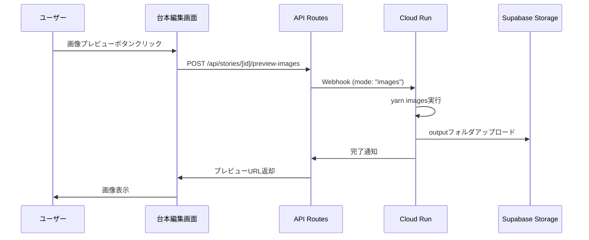

# 画像プレビュー機能実装計画

## 概要

台本編集画面において、本格的な動画生成前に画像のみを生成してプレビューできる機能を追加します。
これにより、ユーザーは画像プロンプトの品質を事前に確認し、必要に応じて調整してから動画生成を行えるようになります。

## 機能要件

1. **画像生成機能**
   - 台本編集画面から画像のみを生成するボタンを追加
   - webhook-handlerで`yarn images`コマンドを実行
   - 生成された画像をSupabaseストレージに保存

2. **プレビュー表示**
   - 生成された画像を台本編集画面内でインラインで表示
   - 各ビート（シーン）ごとの画像を確認可能
   - 画像クリックで拡大表示

3. **プロンプト再編集**
   - プレビュー後、画像プロンプトを修正可能
   - 修正後、再度画像生成を実行可能

## 技術設計

### データフロー



### データモデル変更

#### videosテーブルの拡張

```sql
-- 新しいカラムの追加
ALTER TABLE videos ADD COLUMN preview_data JSONB;
ALTER TABLE videos ADD COLUMN preview_status TEXT;
ALTER TABLE videos ADD COLUMN preview_storage_path TEXT;

-- preview_statusの値
-- 'pending': 画像生成待ち
-- 'processing': 画像生成中
-- 'completed': 画像生成完了
-- 'failed': 画像生成失敗
```

#### preview_dataの構造

```typescript
interface PreviewData {
  images: {
    beatIndex: number;
    fileName: string;
    url: string;
    prompt: string;
  }[];
  generatedAt: string;
  outputPath: string;
}
```

### Supabaseストレージ構造

```
videos/
  [video_id]/
    preview/
      output/
        images/
          script/
            beat_001.png
            beat_002.png
            ...
        script.json
        script.xml
        other_generated_files...
```

## 実装ファイルチェックリスト

### 1. バックエンド（Cloud Run）

#### 編集が必要なファイル

- [ ] `scripts/webhook-handler.js`
  - `generateImages()`関数の追加
  - `yarn images`コマンドの実行処理
  - outputフォルダのSupabaseアップロード処理
  - Webhookルーティングの修正（mode: "images"の処理）

#### 新規作成ファイル

- [ ] `scripts/lib/storage-uploader.js`
  - outputフォルダ全体をSupabaseにアップロードするユーティリティ
  - 階層構造を保持したアップロード機能

### 2. APIエンドポイント（Next.js）

#### 新規作成ファイル

- [ ] `src/app/api/stories/[id]/preview-images/route.ts`
  - POST: 画像プレビュー生成のトリガー
  - GET: プレビュー画像のステータスと URL 取得

- [ ] `src/app/api/videos/[id]/preview/route.ts`
  - GET: プレビュー画像の一覧取得
  - DELETE: プレビュー画像の削除

### 3. フロントエンド（UI）

#### 編集が必要なファイル

- [ ] `src/app/stories/[id]/page.tsx`
  - プレビューボタンの追加
  - プレビュー表示エリアの追加
  - プレビュー状態管理の追加

- [ ] `src/components/editor/script-director/index.tsx`
  - プレビューモードの追加
  - 画像表示機能の統合

#### 新規作成ファイル

- [ ] `src/components/preview/ImagePreview.tsx`
  - 画像プレビューコンポーネント
  - 画像の一覧表示
  - 拡大表示モーダル

- [ ] `src/components/preview/PreviewButton.tsx`
  - プレビュー生成ボタンコンポーネント
  - 生成状態の表示（ローディング、エラー等）

- [ ] `src/hooks/useImagePreview.ts`
  - プレビュー生成と取得のカスタムフック
  - ポーリングによる状態監視
  - エラーハンドリング

### 4. ユーティリティ・型定義

#### 新規作成ファイル

- [ ] `src/types/preview.ts`
  - プレビュー関連の型定義
  - APIレスポンスの型
  - プレビューデータの型

- [ ] `src/lib/preview-utils.ts`
  - プレビュー画像URLの生成
  - ストレージパスの構築
  - プレビューデータの整形

### 5. データベース

#### 新規作成ファイル

- [ ] `migrations/002_add_preview_fields.sql`
  - videosテーブルへのカラム追加
  - インデックスの作成

## API仕様

### POST /api/stories/[id]/preview-images

画像プレビューの生成をトリガーします。

**リクエスト**
```typescript
{
  // ボディは不要（story_idはURLパラメータから取得）
}
```

**レスポンス**
```typescript
{
  videoId: string;
  status: "pending" | "processing";
  message: string;
}
```

### GET /api/videos/[id]/preview

生成されたプレビュー画像の情報を取得します。

**レスポンス**
```typescript
{
  status: "pending" | "processing" | "completed" | "failed";
  previewData?: {
    images: Array<{
      beatIndex: number;
      fileName: string;
      url: string;
      prompt: string;
    }>;
    generatedAt: string;
  };
  error?: string;
}
```

## UI設計

### 台本編集画面の変更

1. **プレビューボタンの配置**
   - ScriptDirectorコンポーネントの上部ツールバーに追加
   - 「画像プレビュー生成」ボタン

2. **プレビュー表示エリア**
   - ScriptDirectorの右側または下部に配置（レスポンシブ対応）
   - サムネイル一覧表示
   - クリックで拡大表示

3. **状態表示**
   - 生成中: プログレスバーとメッセージ
   - 完了: 画像一覧
   - エラー: エラーメッセージと再試行ボタン

## 実装ステップ

### Phase 1: バックエンド基盤（1-2日）
1. webhook-handlerの画像生成モード追加
2. Supabaseストレージアップローダーの実装
3. データベーススキーマの更新

### Phase 2: APIエンドポイント（1日）
1. プレビュー生成APIの実装
2. プレビュー取得APIの実装
3. エラーハンドリングの実装

### Phase 3: フロントエンドUI（2-3日）
1. プレビューボタンの追加
2. 画像表示コンポーネントの実装
3. 状態管理とポーリングの実装
4. レスポンシブデザインの調整

### Phase 4: 統合とテスト（1日）
1. エンドツーエンドの動作確認
2. エラーケースのテスト
3. パフォーマンスの最適化

## セキュリティ考慮事項

1. **アクセス制御**
   - プレビュー画像へのアクセスはUID認証必須
   - Supabase RLSによる保護

2. **レート制限**
   - 画像生成APIに対するレート制限の実装
   - 1ユーザーあたり1分間に1回まで

3. **ストレージ管理**
   - 古いプレビューデータの自動削除
   - ストレージ使用量の監視

## コスト最適化

1. **画像品質設定**
   - プレビューは低品質（low）設定で生成
   - 本番動画生成時のみ高品質

2. **ストレージ最適化**
   - プレビュー画像は7日後に自動削除
   - 必要最小限のファイルのみアップロード

## プロンプト再編集機能について

画像プレビュー生成後、ユーザーは生成された画像を確認し、必要に応じてプロンプトを修正できます。この機能は既存のScriptDirectorコンポーネントの編集機能を活用して実現されます。

### 実装方法

1. **既存の編集機能を活用**
   - ScriptDirectorコンポーネントには既にビート（シーン）ごとの画像プロンプト編集機能が実装済み
   - プレビュー表示中でも、ScriptDirectorで各ビートの画像プロンプトを編集可能

2. **ワークフロー**
   1. ユーザーが画像プレビューを生成
   2. 生成された画像を確認
   3. 改善が必要な画像のプロンプトをScriptDirectorで編集
   4. 「再生成」ボタンで新しいプロンプトで画像を再生成

3. **利点**
   - 既存のUIを活用するため、ユーザーは新しい操作を覚える必要がない
   - プレビューを見ながら編集できるため、直感的な操作が可能

## 今後の拡張可能性

1. **画像個別再生成**
   - 特定のビートのみ再生成機能
   - 全体再生成ではなく、変更されたプロンプトの画像のみ再生成

2. **プロンプト提案**
   - AIによるプロンプト改善提案
   - 生成された画像の品質に基づく自動改善

3. **画像編集機能**
   - 簡易的な画像調整機能の追加
   - フィルターやエフェクトの適用