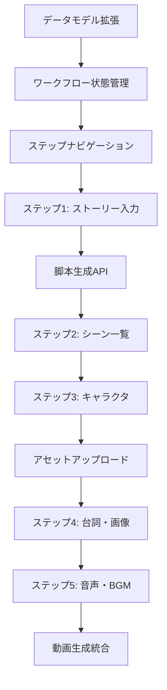

# ScriptDirector V2 実行プラン

## プロジェクト概要
- **プロジェクト名**: ScriptDirector V2 - ワークフローベース動画生成システム
- **期間**: 6-8週間
- **目標**: 段階的な動画生成ワークフローの実装により、ユーザーがより詳細に動画をカスタマイズできるシステムを構築

## タイムライン

### Week 1-2: Phase 1 - 基盤構築
**目標**: データモデルとワークフロー管理の基盤を構築

#### Week 1
- **月-火**: データベース設計とマイグレーション作成
  - [ ] workflow関連カラムの設計
  - [ ] マイグレーションスクリプト作成とテスト
  
- **水-木**: 型定義とスキーマ実装
  - [ ] TypeScript型定義（WorkflowMetadata等）
  - [ ] Zodスキーマ
  - [ ] API基盤の更新
  - [ ] MulmoScript変換レイヤー設計

- **金**: ワークフロー状態管理の実装
  - [ ] useWorkflowStateフック
  - [ ] 状態永続化の仕組み

#### Week 2
- **月**: レスポンシブ基盤構築
  - [ ] ブレークポイントシステム実装
  - [ ] デバイス検出フック作成
  - [ ] レスポンシブコンテナ実装

- **火**: ステップナビゲーションUI
  - [ ] モバイル用下部タブバー
  - [ ] タブレット用サイドバー
  - [ ] デスクトップ用進捗バー

- **水**: タッチ・ジェスチャー対応
  - [ ] スワイプ検出実装
  - [ ] ピンチズーム機能
  - [ ] 長押しドラッグ実装

- **木**: 基本的なレイアウト構築
  - [ ] ScriptDirectorV2メインコンテナ
  - [ ] レスポンシブレイアウト切り替え
  - [ ] デバイス別最適化

- **金**: Phase 1の統合テスト + UXテスト
  - [ ] 実機デバイステスト（iOS/Android）
  - [ ] レスポンシブ動作確認
  - [ ] パフォーマンス測定

### Week 3-4: Phase 2 - ステップ1-3実装
**目標**: ストーリー入力から初期脚本生成まで

#### Week 3
- **月-火**: ステップ1（ストーリー入力）
  - [ ] モバイル: ステップ式フォーム実装
  - [ ] デスクトップ: 2カラムレイアウト実装
  - [ ] 音声入力機能統合
  - [ ] フォームバリデーション

- **水-木**: 脚本生成API
  - [ ] OpenAI統合
  - [ ] プロンプトエンジニアリング
  - [ ] エラーハンドリング
  - [ ] プログレス表示（レスポンシブ対応）

- **金**: ステップ2（シーン一覧）開始
  - [ ] レスポンシブグリッド実装
  - [ ] タッチジェスチャー対応
  - [ ] データ構造設計

#### Week 4
- **月-火**: ステップ2完成
  - [ ] モバイル: 長押しドラッグ、スワイプ削除
  - [ ] デスクトップ: ドラッグ&ドロップ、複数選択
  - [ ] レスポンシブモーダル実装

- **水-木**: ステップ3（キャラクタ一覧）
  - [ ] 適応グリッドレイアウト（2-6列）
  - [ ] モバイル: カメラ統合
  - [ ] デスクトップ: インライン編集

- **金**: アセットアップロード基盤
  - [ ] モバイル: カメラ/ギャラリー最適化
  - [ ] デスクトップ: ドラッグ&ドロップ
  - [ ] プログレッシブアップロード

### Week 5-6: Phase 3 - ステップ4-5と高度な機能
**目標**: 台詞編集から動画生成まで

#### Week 5
- **月-火**: ステップ4（台詞・画像編集）
  - [ ] モバイル: タブ切り替えUI
  - [ ] デスクトップ: 分割画面（リサイズ可能）
  - [ ] フローティングツールバー実装
  - [ ] タッチ最適化エディタ

- **水-木**: シーン詳細生成API
  - [ ] バッチ処理実装
  - [ ] レスポンシブプログレス表示
  - [ ] オフライン時のキュー管理

- **金**: ステップ5（音声・BGM）開始
  - [ ] モバイル: 簡易リスト表示
  - [ ] デスクトップ: タイムライン表示
  - [ ] BGMライブラリ統合

#### Week 6
- **月-火**: ステップ5完成
  - [ ] モバイル: 縦向きタイムライン
  - [ ] デスクトップ: マルチトラック対応
  - [ ] ジェスチャーベース音量調整
  - [ ] 字幕設定（全デバイス対応）

- **水-木**: 動画生成統合とPWA実装
  - [ ] 全ステップのデータ統合
  - [ ] Service Worker実装
  - [ ] オフライン機能実装

- **金**: Phase 3の統合テスト
  - [ ] クロスデバイステスト
  - [ ] パフォーマンス最適化
  - [ ] PWA機能テスト

### Week 7: Phase 4 - 統合とテスト
**目標**: 既存システムとの統合と品質保証

- **月**: 既存システムとの統合
  - [ ] フィーチャーフラグ実装
  - [ ] 移行パス実装
  - [ ] レガシーモード対応

- **火**: レスポンシブテスト
  - [ ] 実機テスト（iPhone, iPad, Android）
  - [ ] ブラウザ互換性テスト
  - [ ] パフォーマンステスト

- **水**: クロスデバイステスト
  - [ ] デバイス間の切り替えテスト
  - [ ] データ同期確認
  - [ ] オフライン機能テスト

- **木**: 包括的テスト
  - [ ] ユニットテスト完成
  - [ ] E2Eテスト実装
  - [ ] アクセシビリティテスト

- **金**: バグ修正とドキュメント
  - [ ] 発見された問題の修正
  - [ ] レスポンシブデザインガイド作成
  - [ ] ユーザーガイド完成

### Week 8: リリース準備
**目標**: 本番環境への準備完了

- **月-火**: パフォーマンス最適化
  - [ ] ロード時間改善
  - [ ] メモリ使用量最適化

- **水-木**: 最終テストとデプロイ準備
  - [ ] ステージング環境でのテスト
  - [ ] デプロイスクリプト準備

- **金**: リリース
  - [ ] 本番デプロイ
  - [ ] 監視設定
  - [ ] ロールバック計画

## 実装順序と依存関係

## マイルストーン

1. **M1 (Week 2)**: 基盤構築完了
   - ワークフロー管理機能が動作
   - ステップナビゲーションUI完成
   - レスポンシブ基盤実装完了
   - 3つのデバイスタイプで基本動作確認

2. **M2 (Week 4)**: 初期脚本生成機能完成
   - ステップ1-3が動作
   - AI生成が成功
   - モバイルでの全機能動作確認
   - タッチ操作の最適化完了

3. **M3 (Week 6)**: 全ワークフロー完成
   - 5ステップすべてが動作
   - エンドツーエンドで動画生成可能
   - クロスデバイステスト完了
   - オフライン基本機能実装

4. **M4 (Week 8)**: 本番リリース
   - 全テスト合格
   - ドキュメント完成
   - 本番環境で稼働
   - 全デバイスでパフォーマンス基準達成
   - アクセシビリティ基準クリア

## リスク管理

### 高リスク項目と対策

1. **AI生成の品質と速度**
   - リスク: 生成時間が長い、品質が不安定
   - 対策: 
     - プロンプトの継続的改善
     - キャッシング戦略
     - 非同期処理とプログレス表示

2. **データ移行の複雑性**
   - リスク: 既存データとの互換性問題
   - 対策:
     - 段階的移行戦略
     - 十分なテスト期間
     - ロールバック計画

3. **UI/UXの複雑化**
   - リスク: ユーザーが混乱する
   - 対策:
     - ユーザーテストの早期実施
     - プログレッシブディスクロージャー
     - ヘルプ機能の充実

4. **レスポンシブ対応の複雑性**
   - リスク: デバイス間での機能差異、レイアウト崩れ
   - 対策:
     - モバイルファースト開発
     - 継続的な実機テスト
     - フィーチャーディテクション実装

### 中リスク項目

1. **パフォーマンス問題**
   - 対策: 
     - 早期からのパフォーマンス測定
     - モバイル特化の最適化
     - 画像・アセットの遅延読み込み

2. **ブラウザ互換性**
   - 対策: 
     - 主要ブラウザでの定期テスト
     - iOS Safari特有の問題への対処
     - ポリフィル戦略

3. **オフライン対応**
   - リスク: データ同期の不整合
   - 対策:
     - 楽観的更新の実装
     - 同期コンフリクト解決ロジック
     - プログレッシブ機能制限

## 成功基準

### 技術的成功基準
- [ ] 全5ステップが正常に動作
- [ ] AI生成成功率 > 95%
- [ ] ページロード時間 < 2秒
- [ ] エラー率 < 5%

### ビジネス成功基準
- [ ] ユーザー完了率 > 80%
- [ ] 平均作成時間 < 30分
- [ ] ユーザー満足度 > 4.0/5.0

## リソース要件

### 開発チーム
- フロントエンド開発者: 2名
  - 1名: ワークフロー機能実装担当
  - 1名: レスポンシブ/モバイル最適化担当
- バックエンド開発者: 1名
- UI/UXデザイナー: 1名（パートタイム）
  - モバイル/タブレット/デスクトップデザイン
- QAエンジニア: 1名（Week 5から）
  - 実機テスト、クロスブラウザテスト担当

### インフラ
- Supabase容量増加（アセット保存用）
- Cloud Run処理能力（必要に応じて）
- OpenAI APIクォータ確認
- テストデバイス
  - iOS: iPhone (複数サイズ)、iPad
  - Android: 各種スマートフォン、タブレット
  - BrowserStack/Sauce Labs アカウント

## コミュニケーション計画

### 定例会議
- **日次スタンドアップ**: 15分
- **週次進捗レビュー**: 金曜日 1時間
- **スプリントレトロ**: 隔週金曜日 30分

### ステークホルダー報告
- **隔週デモ**: 実装済み機能のデモ
- **月次レポート**: 進捗、リスク、次月計画

## 次のアクション

1. **即座に開始**:
   - データベース設計のレビュー
   - 開発環境の準備
   - Phase 1のタスク割り当て
   - レスポンシブデザインシステムの策定
   - ブレークポイント戦略の決定

2. **Week 1で完了**:
   - マイグレーション作成
   - 基本的な型定義
   - CI/CDパイプラインの更新
   - デバイス検出ユーティリティ実装
   - 基本的なレスポンシブコンポーネント作成

3. **準備が必要**:
   - BGMライブラリの選定
   - アセットサイズ制限の決定（デバイス別）
   - エラーメッセージの文言確定
   - テストデバイスの調達
   - BrowserStackアカウント設定
   - モバイルファーストデザインガイドライン作成

## 付録

### 参考資料
- [ScriptDirector V2 実装計画](./script-director-v2-implementation-plan.md)
- [ScriptDirector V2 実装チェックリスト](./script-director-v2-implementation-checklist.md)
- [既存のScriptDirector仕様](./script-director-implementation.md)

### 重要な技術的制約
#### MulmoScript互換性の維持
- **制約**: mulmocast-cliは外部依存のため、MulmoScriptフォーマットは変更不可
- **解決策**:
  1. UI拡張データ（幕構成、BGM設定等）は`workflow_state.metadata`で管理
  2. 動画生成時に標準MulmoScript形式に変換
  3. BGMや特殊効果は別プロセスで後処理
  4. 字幕設定は既存の`captionParams`形式に準拠
- **実装注意**:
  - MulmoScriptインターフェースは変更しない
  - 拡張機能は全て変換レイヤーで処理
  - 互換性テストを必ず実施

### 技術的決定事項
- React 18の新機能活用（Suspense、Concurrent Mode）
- SWRの楽観的更新を活用
- Web Workersでの重い処理実行を検討
- CSS Modules + Tailwind CSS（カスタムブレークポイント）
- react-use-gesture（タッチジェスチャー）
- react-device-detect（デバイス検出）
- next-pwa（PWA対応）
- Zustand（オフライン状態管理）

### 将来の拡張可能性
- AIによる自動提案機能
- コラボレーション機能
- テンプレート機能
- エクスポート機能（各段階のデータ）