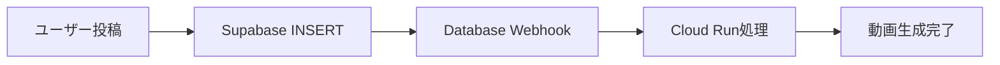

# Webhook API ドキュメント

## 概要

リアルタイム動画処理システムのWebhook APIリファレンスです。

## デプロイ済み環境

### Cloud Run Service
- **サービス名**: `showgeki2-auto-process`
- **URL**: https://showgeki2-auto-process-598866385095.asia-northeast1.run.app
- **Webhookエンドポイント**: `/webhook`
- **ヘルスチェック**: `/health`
- **リソース**: 1 vCPU, 2GB RAM
- **スケーリング**: 0〜10インスタンス

## エンドポイント

### 1. ヘルスチェック
```bash
GET /health
```
**レスポンス**: `OK`

**使用例**:
```bash
curl https://showgeki2-auto-process-598866385095.asia-northeast1.run.app/health
```

### 2. Webhook処理
```bash
POST /webhook
```

**リクエスト例**:
```json
{
  "type": "INSERT",
  "table": "stories",
  "record": {
    "id": "story-id-123",
    "story_text": "ユーザーが投稿したストーリー",
    "created_at": "2025-06-25T23:00:00Z",
    "is_completed": false
  }
}
```

**レスポンス**:
```json
{
  "success": true,
  "message": "Processing started"
}
```

**エラーレスポンス**:
```json
{
  "error": "Invalid JSON"
}
```

## Supabase Webhook設定

### 設定手順

1. **Supabase Dashboard** → **Database** → **Webhooks**
2. **Create a new hook**

### 設定内容

| 項目 | 値 |
|------|-----|
| **Name** | `showgeki2-process-trigger` |
| **Table** | `stories` |
| **Events** | `Insert` |
| **URL** | `https://showgeki2-auto-process-598866385095.asia-northeast1.run.app/webhook` |
| **Method** | `POST` |
| **Headers** | `Content-Type: application/json` |

### SQL設定（オプション）

より詳細な制御が必要な場合、SQL条件を追加可能：

```sql
-- 未完了のストーリーのみ処理
is_completed = false

-- 特定の条件でフィルタリング
story_text IS NOT NULL AND length(story_text) > 10
```

## 処理フロー

### 1. 自動処理（推奨）


**フロントエンド実装例**:
```javascript
// ストーリー投稿
const { data, error } = await supabase
  .from('stories')
  .insert({
    story_text: 'ユーザーのストーリー',
    is_completed: false
  });
// → 自動的にWebhookが発火
```

### 2. 手動テスト（開発用）
```bash
curl -X POST \
  https://showgeki2-auto-process-598866385095.asia-northeast1.run.app/webhook \
  -H "Content-Type: application/json" \
  -d '{
    "type": "INSERT",
    "table": "stories",
    "record": {
      "id": "test-story-123",
      "story_text": "テスト用ストーリー",
      "created_at": "2025-06-25T23:00:00Z",
      "is_completed": false
    }
  }'
```

## セキュリティ考慮事項

### 1. Webhook認証（推奨）

現在は認証なしですが、本番環境では以下を推奨：

```javascript
// webhook-handler.js に追加
const WEBHOOK_SECRET = process.env.WEBHOOK_SECRET;

// 署名検証
function verifyWebhookSignature(payload, signature) {
  const crypto = require('crypto');
  const expectedSignature = crypto
    .createHmac('sha256', WEBHOOK_SECRET)
    .update(payload)
    .digest('hex');
  return signature === expectedSignature;
}
```

### 2. レート制限

```javascript
// レート制限の実装例
const rateLimiter = new Map();

function checkRateLimit(ip) {
  const now = Date.now();
  const requests = rateLimiter.get(ip) || [];
  const recentRequests = requests.filter(time => now - time < 60000); // 1分間
  
  if (recentRequests.length >= 10) { // 1分間に10回まで
    return false;
  }
  
  recentRequests.push(now);
  rateLimiter.set(ip, recentRequests);
  return true;
}
```

## 手動Webhook呼び出し

### 直接呼び出し可能か？

**✅ 技術的には可能** ですが、**推奨されません**。

### 問題点

1. **データ整合性**: Supabaseを経由しないため、データベースとの同期が取れない
2. **重複処理**: 同じストーリーIDで複数回呼び出される可能性
3. **認証不備**: 現在認証機能がない
4. **ログ追跡**: 処理履歴の追跡が困難

### 安全な手動呼び出し方法

#### Option 1: Supabase経由（推奨）
```javascript
// フロントエンドで新規ストーリー作成
const { data, error } = await supabase
  .from('stories')
  .insert({
    story_text: 'ユーザーのストーリー',
    is_completed: false
  });
// → 自動的にWebhookが発火
```

#### Option 2: 管理者用エンドポイント
別途管理者用エンドポイントを作成：

```javascript
// /admin/process エンドポイント
if (req.method === 'POST' && req.url === '/admin/process') {
  const { storyId, adminKey } = JSON.parse(body);
  
  // 管理者認証
  if (adminKey !== process.env.ADMIN_KEY) {
    res.writeHead(401);
    res.end('Unauthorized');
    return;
  }
  
  // 処理開始
  processStory(storyId);
}
```

## テスト

### テストスクリプト実行
```bash
node test-webhook.js
```

### 状態確認
```bash
./check-cloudrun-status.sh
```

## トラブルシューティング

### よくある問題

#### 1. Webhookが発火しない
- Supabase Webhook設定を確認
- Cloud RunサービスのURLが正しいか確認
- ネットワーク接続を確認

#### 2. 処理が重複する
- 同じストーリーIDの重複チェックを実装
- データベースの `is_completed` フラグを活用

#### 3. タイムアウトエラー
- Cloud Runのタイムアウト設定を延長
- 処理を非同期化して即座にレスポンス返却

### デバッグ用コマンド

```bash
# ヘルスチェック
curl https://showgeki2-auto-process-598866385095.asia-northeast1.run.app/health

# Webhook テスト
curl -X POST \
  https://showgeki2-auto-process-598866385095.asia-northeast1.run.app/webhook \
  -H "Content-Type: application/json" \
  -d '{"type":"INSERT","table":"stories","record":{"id":"test-123"}}'

# サービス詳細
gcloud run services describe showgeki2-auto-process \
  --region=asia-northeast1 \
  --project=showgeki2
```

## 監視項目

- **レスポンス時間**: Webhook応答速度
- **エラー率**: 処理失敗の頻度  
- **リソース使用量**: CPU・メモリ使用率
- **同時実行数**: 並行処理数

## 今後の改善案

### 1. 認証強化
- HMAC署名検証の実装
- API Key認証の追加

### 2. 処理状況通知
- WebSocket接続でリアルタイム進捗通知
- メール・Slack通知の追加

### 3. 処理キュー
- Cloud Tasksを使用した非同期処理
- 優先度付きキューの実装

### 4. 監視強化
- Cloud Monitoringアラート設定
- ダッシュボード作成

## まとめ

✅ **リアルタイム処理**: ユーザー投稿と同時に処理開始
✅ **コスト効率**: 処理時のみ課金（96%コスト削減）
✅ **スケーラブル**: 同時処理に対応
✅ **保守性**: サーバーレスで運用負荷軽減

**推奨**: Supabase Database Webhook経由での自動処理
**非推奨**: 直接Webhook呼び出し（セキュリティ・整合性の問題）